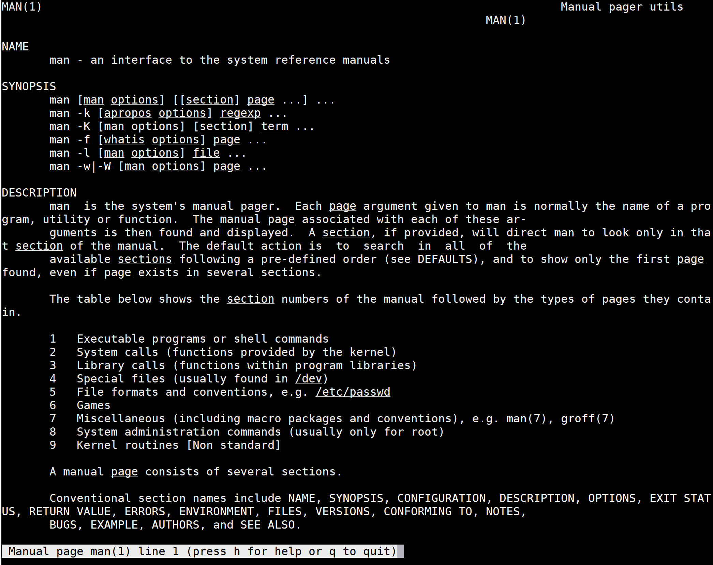

# Bash_It 
## Phase 1: Requirements Gathering
## The Varied Learning Team:
 *	**Ceasar Salas**
 *	**Kailey Stauble**

***

### Executive Summary:

***Purpose of Report***
  - An investigation into potential users of our product to identify their needs and likely rate of use.
  - Gathered requirements to guide an informed, more user centered design compared to existing products

***Methods***
- We use **two methods** to acquire data on our problem
- An **online questionnaire** of Bash users (n=25) to get responses of their experience
- **Studying Documentation** was used for answers questions directly related to content

***Primary User***
- Users of **any age or experience level** looking to learn more or brush up on Bash scripting or commands.

***Primary root cause of problem***
- Users have specified that syntax, complexity, and memorizing commands are the main obstacles when it comes to learning Bash. 

***Current existing solutions***
- Current solutions to this problem are **documentations and websites** such as man pages and sites such as Linux.die.net and other sites such as StackOverflow.

***Personas and Senarios***
- Designed personas and scenarios to represent **three consumer archetypes** with different priorities:
  - Lola: A new computer science student in college; learns about Bash scripting for the first time as well as to answer any questions she may have.
  - Charlie: A person who is working full time at a company; although he is already familiar with scripting, our platform is straightforward and makes it easy to quickly refresh his memory. 
  - Enzo: A graduate student seeking their master’s degree in computer science; who works with complex topics and commands he hasn’t used before. 

***

### Methods:
The methods that we chose to use to conduct the requirements gathering aspect of our project were a questionnaire and studying documentation. 

The questionnaire, which was simply called the "Bash Questionnaire", got a limited number of responses(n=25). It features 15 questions in a variety of formats: 
- Likert Scale(n=6)
- Short Answer (n=2)
- Multiple Choice (n=4)
- True and False (n=1)
- Checkboxes (n=2)

These questions were made with 2 goals in mind:'what is the user's existing knowledge Bash?', 'what does this user hope to learn about Bash?'.

The study documentation method for data gathering was focused on the acquisition of content needed for our product. Since our product could be described as an aggregation of content, we need a reliable method to get this data with the fewest errors in it as possible. We look at 2 different websites for said reliable data:
- Linux.die.net (preferred)
- man7.org
We had a few questions in mind when looking at these sites: 'what is the interface to get the content currently?', 'how could the content be made more readable?', 'how easy is it to understand and use the content?'

***

### Findings:

For our questionnaire method, we specified that we were looking for a response from anyone who may code or be interested in code, especially Bash and/or command line. The users who we heard back from may have skewed the results and the user base that we were looking to hear from as they were almost all computer science students. Because of this, we received unbalanced results where most users were already very comfortable with Bash and command line and therefore may not be as interested in a product that is attempting to make an introduction to these topics easier. 

Our findings showed that there is a lot of interest in Bash scripting as a topic, which is positive feedback for creating a platform that allows users to more easily grasp Bash as a topic. Some promising results came from asking users to agree or disagree with the statement “I do not know anything about Bash”, which resulted in 80% of users indicating that they either disagreed or strongly disagreed, giving us a baseline of knowledge for users. Once again, this feedback is skewed given the demographic of those who responded to the questionnaire (computer science students) but will also push us to create a platform for all levels of knowledge regarding Bash. 

When asked if they would like to learn more about Bash, 76% of users either agreed or strongly agreed, indicating that users, even with a strong base knowledge of Bash, would still be very interested in learning more and therefore likely interested in a platform built to teach Bash specifically. In addition to this, 88% of respondents indicated that they would like to write automated scripts, which shows the overall interest in scripting in general and also may help us to focus on what information we include on the learning platform. 

Another helpful insight we received was in response to the question “What do you find the most intimidating about learning Bash?”, which resulted in many short answer responses such as the syntax, memorizing the commands, the complexity of it, when and how to use it, and getting started using it. These short answer responses gave us a look into what users are struggling with when it comes to learning Bash scripting which gives us the ability to focus on how to make these aspects of learning Bash simpler and more user-friendly. When asked what their preferred place to have Bash questions answered was, the majority of users indicated that they prefer to search on the internet for help more than any other option (40%), followed closely by using websites to look for answers (32%). This is positive feedback for our product as we will be offering an online platform to help users learn and answer questions they may have, which seems to be a popular method among users. 

An interesting find in our questionnaire feedback was that users overwhelmingly prefer to visit the website StackOverflow when they have questions concerning Bash (91.7%). This indicates to us that we should utilize the ease and straightforwardness of using StackOverflow when designing our own platform so that users will feel compelled to use Bash_It as their number one resource. 

For our study documentation method, we asked ourselves questions such as “how complicated it is to read or hard to understand?”, “how could it be improved?”, and “is there a built in example of the command use? “ while also keeping in mind what a user’s goals may be while looking through the documentation. Our goal for studying different documentation was to discover what was good and worked for users and then to replicate that on our own platform as well as discover what was not working for users and avoid those methods. We used these questions as well as what worked and did not work as a rubric while looking through documentation and discovered that readability was an important factor in whether or not a certain documentation will be useful to a reader. That, as well as simplicity and using examples were determined to be important aspects of good documentation when it comes to Bash. A user should also be able to easily use the documentation as well as easily understand it. 

***

### Conclusions:

We hoped to get answers to two broad questions for each of the research gathering methods we mentioned, questionnaire and study documentation. 

_Online questionnaire: 'what is the user's existing knowledge of Bash?'_ 
Perhaps it was a result of biased data, but we have found that a significant portion of our responses indicated(I do not know anything about Bash; 83.3% disagree) a high or sufficient level of existing understanding of Bash and command line. Although the responders who answered they knew little were a minority(I do not know anything about Bash; 12.5% agree), it is still notable that our product would be useful to such a group. 

_Online questionnaire: 'what does this user hope to learn about Bash?'_ 
A large majority(I would like to learn more about Bash; 75%) of responses have a strong indicatication toward wanting to learn something new. This majority only grows as when the user has been asked about learning a specific functionality of Bash, Makefile was a given example. In the short answer section of "What do you find the most intimidating about learning Bash?" we got a large variety of responses that were fairly consistent with what we expected. The responder's worries are able to be easily categorized, and such responses most commonly in the realm of concerning syntax. 

_Study Documentation: 'what is the interface to get the content currently?'_ 
The current interfaces for reliable data are the official man pages that can be viewed through the terminal using the command "man" and the other two websites we mentioned which show the content in a slightly different format. These formats are entirely text based, with no code segments to demonstrate usage. The terminal format is entirely text with no direct links to other reference pages or the like. From there, there is no easy way to get exact information for troubleshooting or other assisting details(What is the number next to the command for? is a common one). 
Below is a screenshot of the terminal interface of the 'man' page for 'man'. For refrence, 'man' is short for manual and is the go to command for learning about any Bash command that you are uncertain of.

_Study Documentation: 'how could the content be made more readable?'_ 
The content can be made readable through a combination of font differences, prioritized content, and stronger notices for how the specific information can get used. Many of the words by function in these files are all caps, bolded, or italicized, with little to no direct explanation as to why. Usage of a particular command can also be confusing to first time readers. The  website like cplusplus.com as a reference for a better readable format, compared to the less readable cppreferrence.com website. 

_Study Documentation: 'how easy is it to understand and use the content?'_ 
As mentioned in the above paragraph: there are no links to other helpful pages, the font style may change, and there are other unexplained details. The content feels very raw to most first time users and can be very intimidating. Much of the locatable help pages do not expand into more complicated commands or functions. While StackOverflow is very useful for troubleshooting, since it is in a forum format, the help may not be applicable to the user. 

***

### Caveats:

Some limitations that arose from using a questionnaire as a method were that we did not receive as many responses as we would have liked, resulting in less data that we could collect to determine that course of our project. Additionally, the questions themselves may have been limited to those responding so we did not get as much perspective as we could have gotten using other methods. For example, users could indicate how much they agreed or disagreed with a statement but could not provide further specifications. 
Our survey has strong bias in the favor of the following traits attribute to either the survey or the survey responders:
- Majority male
- Majority young adult
- Classroom environment
- Undergraduate College Student
- Moderate existing knowledge of programming
- Large personal usage of website "Stackoverflow.com" 
- Having too few questions to properly represent the topic

Our other method, studying documentation, included the caveats that we were limited in the amount of documentation that we could look at including websites and man pages. Also, this method is not centered around the user’s experience specifically, and although we kept the user in mind while studying, there was no direct user feedback. 

***

### Personas:

Our persona archetypes can be loosely grouped into two categories consisting of those who know Bash already and those do not. The nuances of such can be further divided into amount of current knowledge, desire to learn, and active usage. 
Said personas are likely to be biased toward being college educated, computer science oriented, and male. 

- Lola: A new computer science student in college who is learning to script for the first time and is looking for a variety of tools to assist her in learning the basics of Bash.

- Charlie: A person who is working full time at a company and utilizes scripts on a daily basis but needs to brush up on the particular usage of a certain command. 

- Enzo: A graduate student seeking their master’s degree in computer science who is already knowledgeable on Bash and the basics but needs to continue learning specific topics and complexities of the language as he works towards his degree. 

***

### Scenarios:

The scenarios we could generate from our questionnaire could fall into the following fields:
- Need/ want to use a script file 
- Need/ want to simply learn
- Need/ want to know how a particular command works

From those three fields above, we have extropolated that out into being senarios to pair with each persona we have created in the previous section:
- Lola: She has a need to use a platform such as Bash_It to help guide her as she learns about Bash scripting for the first time as well as to answer any questions she may have. It would serve as a supplement to the classes she is taking at her university.

- Charlie: He would utilize Bash_It for the simplicity and ease of use- although he is already familiar with scripting, our platform is straightforward and makes it easy to quickly refresh his memory on how a certain command is used during his busy workday.

- Enzo: Bash_It would be helpful to him as a graduate student as he works through projects and has to become more familiar with complex topics and commands he hasn’t used before. 

***

### Supplementary Materials:
Our questionnaire: https://docs.google.com/forms/d/e/1FAIpQLSfjFI2He-Zmu4ZWObaMgaJ9SNJ0Ez7y_9gr_7COcI6cUqM0zA/viewform

Study Documentation Materials:
Man pages (Can be viewed from any command line interface)
https://linux.die.net/
https://devhints.io/bash
https://www.educative.io/blog/bash-shell-command-cheat-sheet
https://realpython.com/beautiful-soup-web-scraper-python/
https://stackoverflow.com/questions/tagged/bash?tab=Votes

# Team Name, Phase 1: Requirements Gathering

## Methods

## Findings

## Conclusions

## Caveats

## Supplementary Materials

[See dedicated page for Personas and Scenarios created from Phase 1 findings](../personas-scenarios.md)

Include link(s) or cop(ies) to your instrument(s) itself (questionnaire for a survey, protocol for an interview or contextual inquiry, etc) as PDF documents.
