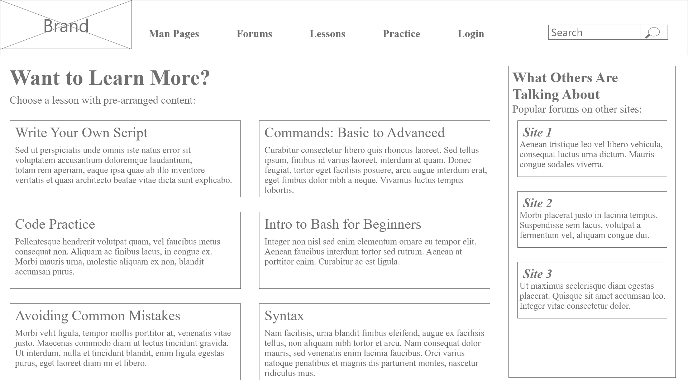

## Phase 2: User-Centered Design

### Executive Summary 

We have created and revised a collection of wireframes that can serve as a first draft of our design. The overall source of inspiration for the wireframes is a combination of simplicity, learnability, and relatable contemporary design. Simplicity and Learnibllty come in the forms of trying to have things divided and spaced so that it is easy to differentiate between categories while feeling intuitive to the user. For our more contemporary features, we used the websites: Codecademy.com, StackOverflow.com, and CPlusPlus.com as our references. 

***

### Our Wireframes

###### ***Landing Page:***
The landing page for Bash_It is specifically designed to be simple and allows the user to select or search for a topic of their choosing. Because Bash as a topic is so broad, this allows users to narrow their searches to what they are looking for which lessens confusion about where to begin. In pessimistic terms, it could even be called one large search bar. 

***

##### ***Search Results:***
The search results page can be reached either by selecting a popular topic on the landing page' carousel or by using the search bar within the navigation bar. The selected topic will have various ways that the user can begin to learn about it, starting with some reading material that is sorted by beginner, intermediate, and refresher levels which indicate a user’s knowledge on that topic to that point. The results also include other popular forms of learning such as videos, hands-on practice, examples, and forums. These are neatly organized on the search results page and limited so as to not overwhelm new users. 

*** 

##### ***Information Page:***
The information page is sorted based on user knowledge; the user will select their knowledge level and be taken to a page appropriate for them. In this example, a beginner user would see these results from the information page and would be able to learn basic Bash information as well as follow links that would lead them to other ways of learning such as lessons. On many pages including this one, we decided to include basic commands or a link to basic commands to continuously teach these to users due to questionnaire results indicating that users had trouble at first due to all the new commands. 

***

##### ***Learn More Page:***
The learn more page is where the platform has curated lessons that integrate many different ways of learning in order to help users retain what they learn. On this page, users can choose a topic and rather than selecting how they want to learn, they can go through these step by step lessons which are a more guided approach to learning Bash. These lessons range from basic commands to writing scripts and can cater to any user.

*** 

##### ***Lesson Plan Page:***
The lesson plan page is where the user is directed to after they have selected a lesson that they would like to go through. The lesson plan is listed for the user to see and each step is visible on the page and is interactive for the user depending on the task. The lessons are a way to integrate varied learning as an idea into the site by encouraging users to utilize all that the site has to offer from videos to practice problems.

*** 

##### ***Easy Practice Page:***
The easy practice page is an example of a practice page that users are directed to if they wish to practice the code on their own. This page shows how a user might be presented with an easier problem such as practicing with the ‘ls’ command by using the VM terminal provided on the page. The user can also use the topic link to go to the man page and learn more about the command they are using or the other problems bar to select an easier or a harder problem to practice with. This page again caters to all levels of learning and promotes interest in the topic by providing as much information as possible and allowing users to make mistakes and learn from them.

***

##### ***Hard Practice Page:***
The hard practice page is similar to the easy practice page but demonstrates how a user might be presented a tougher problem that asks them to write a script. Rather than interacting with a VM to practice commands, the user can use the space given to write a script, then they can run their code and see the output of their script on the right hand screen. This gives the user direct feedback on whether or not their code worked and error messages if they did not. If needed, the user can select an easier or a harder practice problem on a topic that interests them at the bottom of the page which also promotes further interest in learning Bash. 

***

##### ***Forums Page:***
The forums page is a very useful feature that will benefit users given that almost all participants in the questionnaire indicated that the website StackOverflow was a go-to choice for questions concerning Bash. Because of this, the forums page mimics that same environment but on the Bash_It platform. Users can search the forum and find previously asked questions or write a new question of their own to have answered. The benefit of having this page on the Bash_It platform is that it allows users to learn Bash in one place as well as easily include code in their questions from practice problems. 

##### ***Make Forum Post Page:***
This page is what users will see when they choose to create a new forum post. It allows them to write out their question as well as assign tags to it in order to be more visible to any users who may be able to help. 

***

##### ***Man Page:***
The man page is an important aspect of Bash_It as man pages are a source of help when learning bash in a terminal. However, in our study documentation research we found that man pages were not well organized and had readability issues that made it difficult especially for newcomers to Bash. With this in mind, the man page on Bash_It is a well-organized and easy to read page for any command that a user wants to learn more about.

***

##### ***Join Page:***
The join page is where users can sign up to be a part of Bash_It, allowing them to contribute to forums, save their progress in practice problems and lessons, and keep track of what they’ve learned. It also promotes users returning to the site to continue learning Bash.

*** 

##### ***Login Page:***
A simple login page that also allows users to join the site if they have not registered in the past. Once logging in, they have access to posting on the forums and seeing the progress they have made on the site so far.

***

##### ***Account Page:***
The view of an account page that a user would see when looking at their own page. It includes options for the user to reset their password or to logout and also includes recent activity as well as the user’s most viewed topics. This is an important feature because users can be motivated by seeing what they have done in the past and their progress to continue what they were working on and learning Bash. 

***

##### ***Visiting Account page:***
This is the view of an account page by another user, so the editing features are gone and it is more polished. Recent user activity is not displayed but users can see forum posts that the other users have made which encourages forum use. 

***

##### ***External Site:***
This is a placeholder page that indicates that the user will be transferred to another website from what they selected on Bash_It.

***
***

### Supplementary Materials

##### Link to our Prototype in Adobe XD
Click through prototype:  
https://xd.adobe.com/view/c58e83a1-0a07-43b8-a67d-16913158bbbc-90dd/

List of comprehensive wireframes:  
https://github.com/UsabilityEngineering/VariedLearning/tree/master/phase2/UX_Project_ArtBoards

